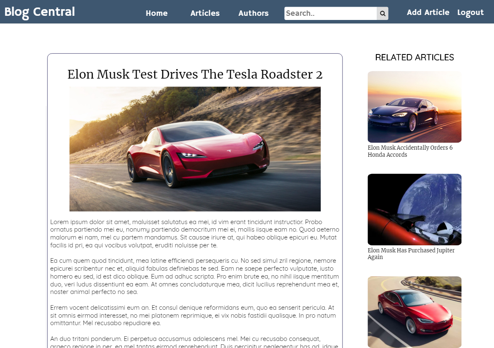
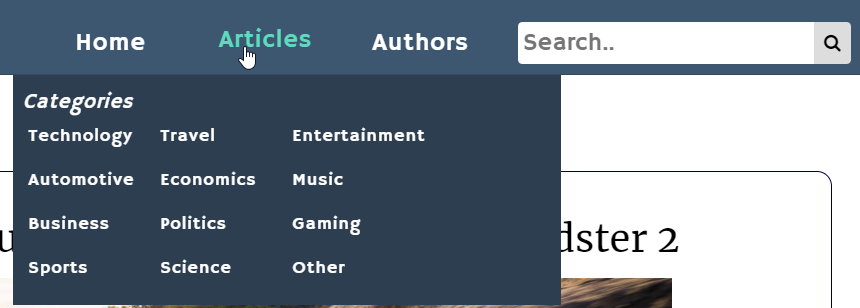
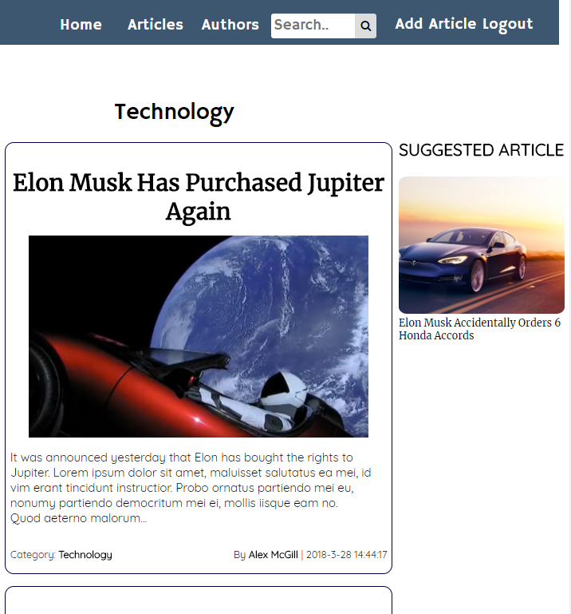
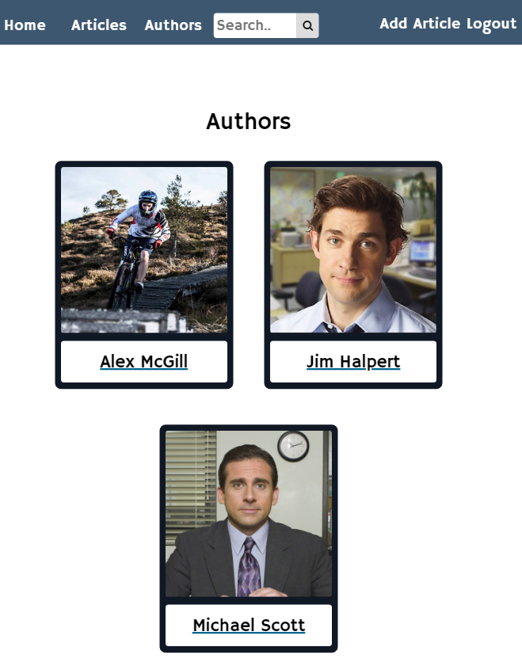
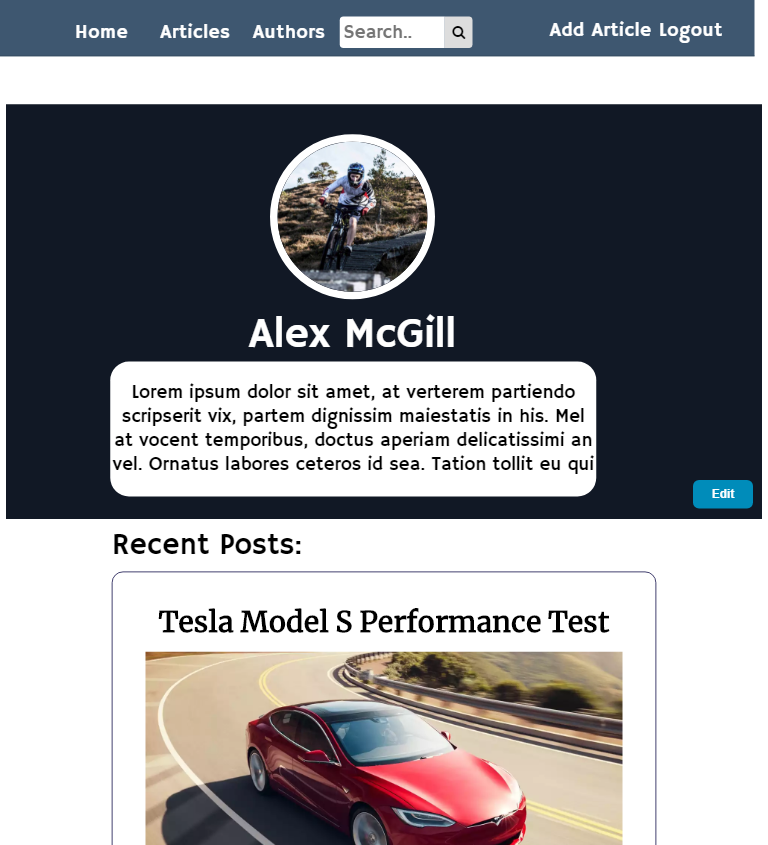
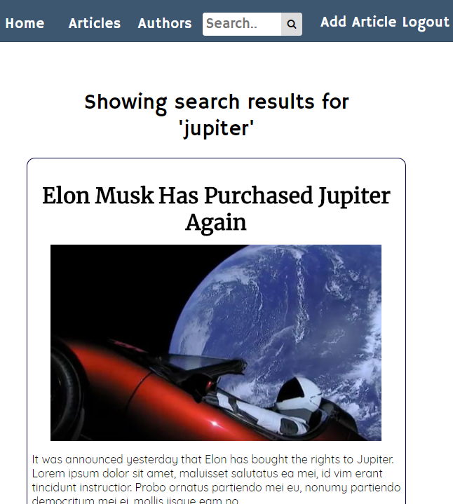

# Blog Central
> A multi-user blog platform built using Node.JS, JavaScript, Pug & CSS



## Features

Responsive Navigation Bar:



Category Filtering, Article Previews & Article Suggestions:



Author List:



Author Profiles:



Search Functionality:



## Dependencies
* [Node.JS](https://nodejs.org)

* [bcryptjs](https://www.npmjs.com/package/bcryptjs)
* [body-parser](https://www.npmjs.com/package/body-parser)
* [connect-flash](https://www.npmjs.com/package/connect-flash)
* [express](https://www.npmjs.com/package/express)
* [express-messages](https://www.npmjs.com/package/express-messages)
* [express-session](https://www.npmjs.com/package/express-session)
* [express-validator](https://www.npmjs.com/package/express-validator)
* [mongodb](https://www.npmjs.com/package/mongodb)
* [mongoose](https://www.npmjs.com/package/mongoose)
* [passport](https://www.npmjs.com/package/passport)
* [passport-local](https://www.npmjs.com/package/passport-local)
* [pug](https://www.npmjs.com/package/pug)


## Required Development Setup

* Install Node.JS 
* Use the following commands to install the required Node.JS packages into 'blog/node_modules':

```sh
npm install bcryptjs
npm install body-parser
npm install connect-flash
npm install express
npm install express-messages
npm install express-session
npm install express-validator
npm install mongodb --save
npm install mongoose
npm install passport
npm install passport-local
npm install pug

```

* Create and configure the following file before running the server from your own machine

| File             | Purpose     |
| -----------------|-------------|
| blog/config/db.js| Where the config file for the database is stored|

## Usage

Once all of the Node.JS packages are installed and the db.js file has been configured:
* Using Windows Command Prompt set the current directory to the <b>/blog/</b> directory
* Enter the command: <b>"node server.js"</b>
* Setup complete! You should see the success message as shown in the image below
* Go to http://localhost:3000/ to access the site


![running]


## Meta

Distributed under the [MIT license](https://choosealicense.com/licenses/mit/). See ``LICENSE`` for more information.

Author [@mcgill-a](https://github.com/mcgill-a)

<!-- Markdown link & img dfn's -->
[running]: https://i.imgur.com/O4KfXlf.png
